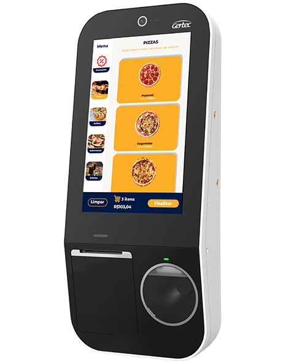
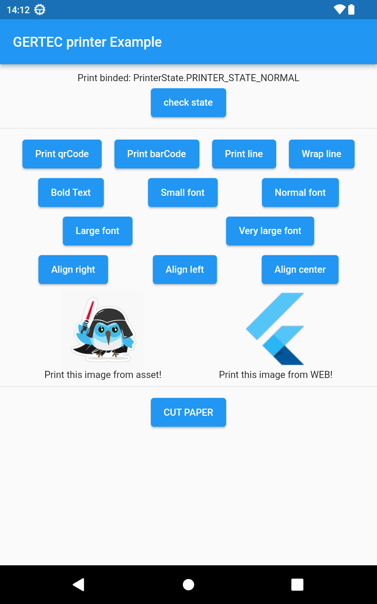

# gertec
# Package para trabalhar com os componentes da gertec <strong>SOMENTE em ANDROID! 


# IMPORTANTE!!!!!
Devida a compilaçāo em release mode, é necessário colocar essas diretivas no seu gradle na parte de release

```gradle
 buildTypes {
    release {
        signingConfig = signingConfigs.debug
        minifyEnabled false // <<False para minificacao >>
        shrinkResources false  // <<False para shrink >>
    }
}
```
# Iniciando
**Por mais que o código esteja em inglês, o readme e o CHANGELOG estarão em português para facilitar o entendimento**

Este package tem como finalidade ajudar os desenvolvedores que precisam utilizar algum componente da elgin/bematech, pois eles são bem chatos de configurar e acaba as vezes sendo bem frustrante!


 ## Package foi testado em:
```bash
Gertec SK-210 
```




### Portanto se você quiser ajudar a homologar mais aparelhos me contate para que possamos agilizar esse processo   
## O que o package faz até o momento

# IMPRESSORA
- [ x ] Escreve uma linha ou um texto estilizado (tipos de estilo no final do readme) -  **printText**
- [ x ] Avança x linhas à sua escolha - **wrap**
- [ x ] Faz o corte de papel - **cutPaper**
- [ x ] Imprime códigos de barras de todos os estilos e modelos (tipos de modelos no final do readme) - **printBarCode**
- [ x ] Imprime qrcodes com todos os tipos de correções e tamanhos - **printQrcode**
- [ x ] Desenha uma linha com o caractere customizável para separar áreas de impressão  - **line**
- [ x ] Imprime uma imagem tanto vinda da web quanto de algum asset (ver exemplo) - **printImage**
- [ x ] Pega e status da impressora (tipos disponíveis no final do readme)
- [ x ] Faz leitura de barcode e qrcode no leitor ao lado da impressora


**Tela com as funcionalidades de exemplo**




## Comandos básicos para impressão direta ##

```dart
    final  _gertecPrinterPlugin = GertecPrinter();
    await _gertecPrinterPlugin.printText('HELLO PRINTER');
    await _gertecPrinterPlugin.wrapLine(2);
    await _gertecPrinterPlugin.cutPaper();
    
   
```

## Comandos básicos para impressao em buffer##

```dart
    final  _gertecPrinterPlugin = GertecPrinter();
    await _gertecPrinterPlugin.startTransaction();
    await _gertecPrinterPlugin.printText('HELLO PRINTER');
    await _gertecPrinterPlugin.printText('HELLO PRINTER');
    await _gertecPrinterPlugin.printText('HELLO PRINTER');
    await _gertecPrinterPlugin.printQrcode(text: 'RECIBO DE PAGAMENTO TESTE', height: 300, width: 200);
    await _gertecPrinterPlugin.wrapLine(2);
    await _gertecPrinterPlugin.cutPaper();
    await _gertecPrinterPlugin.finishTransaction();
    
```
## Listagem de configurações disponíveis


<details>
<summary>Erros que são capturados pelo  <strong>printerState()</strong></summary>


```dart
///Where in the barcode the text will be show
enum PrinterState {
  PRINTER_STATE_NORMAL(0),
  PRINTER_STATE_NOPAPER(1),
  PRINTER_STATE_HIGHTEMP(2),
  PRINTER_STATE_UNKNOWN(3),
  PRINTER_STATE_NOT_OPEN(4),
  PRINTER_STATE_DEV_ERROR(5),
  PRINTER_STATE_LOWVOL_ERROR(6),
  PRINTER_STATE_BUSY(7),
  PRINTER_STATE_CUT(8),
  PRINTER_STATE_OUT(9),
  PRINTER_PAPER_RUN_OUT(10),
  PRINTER_COVER_OPEN(11),
  PRINT_ERROR_PARAMETER(12);

  const PrinterState(this.value);
  final int value;
}

```
</details>


<details>
<summary><strong>Tipos de código de barras</strong></summary>

```dart
enum BarCodeType {
  BARCODE_TYPE_UPCA(65),
  BARCODE_TYPE_UPCE(66),
  BARCODE_TYPE_JAN13(67),
  BARCODE_TYPE_JAN8(68),
  BARCODE_TYPE_CODE39(69),
  BARCODE_TYPE_ITF(70),
  BARCODE_TYPE_CODEBAR(71),
  BARCODE_TYPE_CODE93(72),
  BARCODE_TYPE_CODE128(73);

  const BarCodeType(this.value);
  final int value;
}
```

</details>


<details>
<summary><strong>Tipos de alinhamentos</strong></summary>

```dart
enum PrintAlign {
  LEFT(0),
  CENTER(1),
  RIGHT(2);

  final int value;
  const PrintAlign(this.value);
}
```
</details>


<details>
<summary><strong>Tamanho de fontes disponíveis</strong></summary>

```dart
enum FontSize {
  SMALL(4),
  NORMAL(8),
  LARGE(16),
  XLARGE(24);

  final int value;
  const FontSize(this.value);
}
```
</details>


<br>
<hr>
Esse package te ajudou? quer mais coisas nele ou outros devices elgin? Me ajude a manter o projeto ativo e implementar novos equipamentos (que provavelmente terei que adquirir)

[](https://www.paypal.com/donate?business=5BMWJ9CYNVDAE&no_recurring=0&currency_code=BRL)
